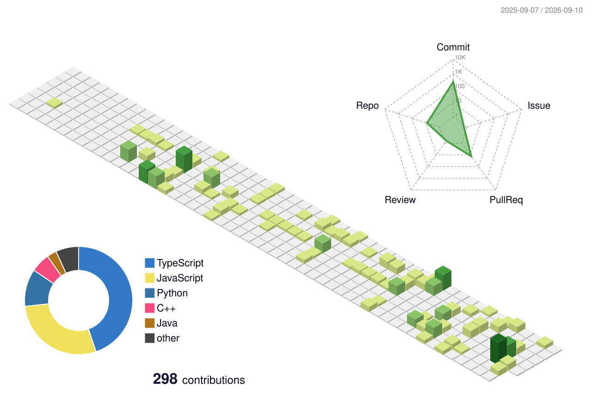

# Hi, I'm Kim Jong Hyun 👋

### Frontend Developer

React와 TypeScript를 중심으로 웹 서비스를 만들고 있습니다.  
최근에는 **Frontend × AI** 영역의 프로젝트를 탐구하고 있습니다.

`Frontend` `React` `TypeScript` `AI`

 

 

## 🗂️ Selected Repositories

| Repository | About | Stack | |
| --- | --- | --- | :---: |
| **MIRUM** | 대학생 팀 프로젝트를 위한 통합 협업 플랫폼 | `React` `TypeScript` `Vite` | [↗](https://github.com/Hanshin-OSS-Hub/capstone25-mirum) |
| **Context Bridge** | 사용자 맥락을 선별해 AI 응답에 연결하는 서비스 | `React` `Gemini` | [↗](https://github.com/ABC26-SUMMER/context_bridge) |
| **Harnest** | Goal-oriented AI Harness | `React` `AI Agent` | [↗](https://github.com/NiceTry3675/OSS_Harnest) |
| **Evacuation Simulator** | Minecraft × AI × IoT 재난 대피 시뮬레이션 | `MediaPipe` `MQTT` `Minecraft` | [↗](https://github.com/ABC-Hackathon25/evacuation-simulator) |
| **얼마야** | OCR 기반 메뉴별 정산 웹 서비스 | `React` `TypeScript` `Supabase` | [↗](https://github.com/KimJongHyun2/ulmaya) |

 

## 🧰 Toolbox

  

React · TypeScript · JavaScript · Vite · Tailwind CSS · Git · GitHub

 

<b>🌱 GitHub Activity</b>

 

 

  Frontend · React · TypeScript · AI

